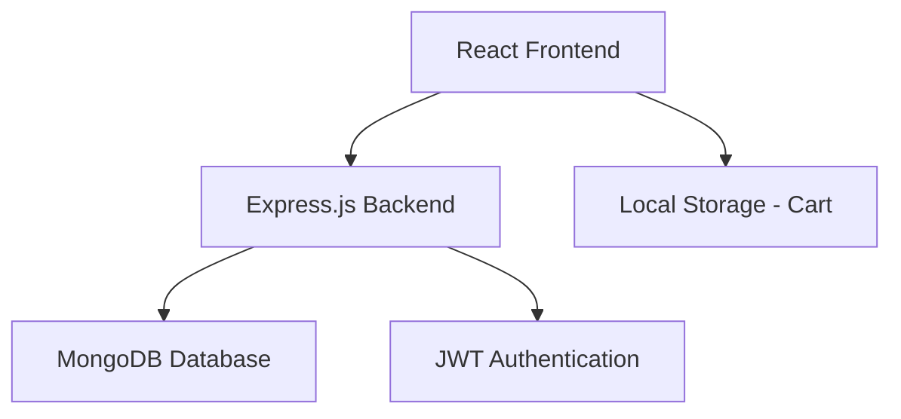

# Design Document

## Overview

This design document outlines the architecture for a simple e-commerce website built with the MERN stack. The application follows a traditional client-server architecture with a React frontend, Express.js backend, and MongoDB database. The design prioritizes simplicity and functionality over advanced features, making it suitable for a V-Internship project.

## Architecture

### High-Level Architecture



### Technology Stack

- **Frontend**: React 18+ with React Router for navigation
- **Styling**: Bootstrap 5 or simple CSS for responsive design
- **Backend**: Node.js with Express.js framework
- **Database**: MongoDB with Mongoose ODM
- **Authentication**: JWT tokens with bcrypt for password hashing
- **HTTP Client**: Axios for API communication
- **State Management**: React hooks (useState, useEffect) and localStorage for cart

## Components and Interfaces

### Frontend Components

#### Core Components
- **App.js**: Main application component with routing
- **Navbar.js**: Navigation bar with authentication status
- **Home.js**: Product listing with filtering capabilities
- **ProductDetails.js**: Individual product view
- **Cart.js**: Shopping cart management
- **Checkout.js**: Order placement form
- **Login.js**: User authentication form
- **Register.js**: User registration form

#### Utility Components
- **ProductCard.js**: Reusable product display component
- **FilterBar.js**: Product filtering controls
- **ProtectedRoute.js**: Route wrapper for authentication

### Backend API Endpoints

#### Product Routes
- `GET /api/products` - Retrieve all products with optional filtering
- `GET /api/products/:id` - Retrieve single product by ID
- `POST /api/products` - Add new product (for seeding)

#### Authentication Routes
- `POST /api/auth/register` - User registration
- `POST /api/auth/login` - User login
- `GET /api/auth/profile` - Get user profile (protected)

#### Order Routes
- `POST /api/orders` - Create new order (protected)

### Frontend-Backend Interface

#### API Response Formats

**Product Object:**
```json
{
  "_id": "string",
  "name": "string",
  "price": "number",
  "description": "string",
  "imageUrl": "string",
  "category": "string"
}
```

**User Object:**
```json
{
  "_id": "string",
  "name": "string",
  "email": "string",
  "password": "string (hashed)"
}
```

**Order Object:**
```json
{
  "_id": "string",
  "userId": "string",
  "items": "array",
  "totalAmount": "number",
  "customerInfo": {
    "name": "string",
    "address": "string",
    "paymentMethod": "string"
  },
  "createdAt": "date"
}
```

## Data Models

### MongoDB Collections

#### Products Collection
```javascript
{
  name: { type: String, required: true },
  price: { type: Number, required: true },
  description: { type: String, required: true },
  imageUrl: { type: String, required: true },
  category: { type: String, required: true },
  createdAt: { type: Date, default: Date.now }
}
```

#### Users Collection
```javascript
{
  name: { type: String, required: true },
  email: { type: String, required: true, unique: true },
  password: { type: String, required: true },
  createdAt: { type: Date, default: Date.now }
}
```

#### Orders Collection
```javascript
{
  userId: { type: ObjectId, ref: 'User', required: true },
  items: [{
    productId: { type: ObjectId, ref: 'Product' },
    name: String,
    price: Number,
    quantity: Number
  }],
  totalAmount: { type: Number, required: true },
  customerInfo: {
    name: { type: String, required: true },
    address: { type: String, required: true },
    paymentMethod: { type: String, required: true }
  },
  createdAt: { type: Date, default: Date.now }
}
```

### Client-Side Data Management

#### Cart State (localStorage)
```javascript
{
  items: [
    {
      productId: "string",
      name: "string",
      price: "number",
      quantity: "number",
      imageUrl: "string"
    }
  ],
  totalAmount: "number"
}
```

#### Authentication State (localStorage)
```javascript
{
  token: "string",
  user: {
    id: "string",
    name: "string",
    email: "string"
  }
}
```

## Error Handling

### Backend Error Handling

#### Error Response Format
```json
{
  "success": false,
  "message": "Error description",
  "error": "Detailed error information (development only)"
}
```

#### Error Categories
- **Validation Errors**: 400 Bad Request for invalid input data
- **Authentication Errors**: 401 Unauthorized for invalid/missing tokens
- **Authorization Errors**: 403 Forbidden for insufficient permissions
- **Not Found Errors**: 404 Not Found for missing resources
- **Server Errors**: 500 Internal Server Error for unexpected issues

### Frontend Error Handling

#### Error Display Strategy
- **Form Validation**: Real-time validation with error messages below fields
- **API Errors**: Toast notifications or alert messages for user feedback
- **Network Errors**: Retry mechanisms with user notification
- **Authentication Errors**: Automatic redirect to login page

#### Error Boundaries
- Implement React Error Boundaries for component-level error catching
- Fallback UI for broken components
- Error logging for debugging purposes

## Testing Strategy

### Backend Testing

#### Unit Tests
- Model validation tests using Jest
- Route handler tests with supertest
- Authentication middleware tests
- Database operation tests with test database

#### Integration Tests
- API endpoint tests with full request/response cycle
- Database integration tests
- Authentication flow tests

### Frontend Testing

#### Component Tests
- React component rendering tests with React Testing Library
- User interaction tests (clicks, form submissions)
- Props and state management tests

#### Integration Tests
- API integration tests with mock backend
- Authentication flow tests
- Cart functionality tests
- Routing tests

### Manual Testing Checklist

#### Core Functionality
- [ ] User registration and login
- [ ] Product browsing and filtering
- [ ] Add to cart functionality
- [ ] Cart management (update quantities, remove items)
- [ ] Checkout process
- [ ] Order placement

#### Edge Cases
- [ ] Empty cart checkout attempt
- [ ] Invalid product ID access
- [ ] Expired token handling
- [ ] Network connectivity issues
- [ ] Form validation errors

### Development Workflow

#### Project Structure
```
simple-ecommerce/
├── backend/
│   ├── models/
│   ├── routes/
│   ├── middleware/
│   ├── config/
│   └── server.js
├── frontend/
│   ├── src/
│   │   ├── components/
│   │   ├── pages/
│   │   ├── utils/
│   │   └── App.js
│   └── public/
└── README.md
```

#### Development Phases
1. **Backend Setup**: Database connection, models, and API routes
2. **Authentication**: JWT implementation and protected routes
3. **Frontend Setup**: React components and routing
4. **Integration**: Connect frontend to backend APIs
5. **Styling**: Apply Bootstrap/CSS for responsive design
6. **Testing**: Manual testing and bug fixes
7. **Data Seeding**: Add sample products to database

This design provides a solid foundation for building a simple yet functional e-commerce website that meets all the specified requirements while maintaining code simplicity and clarity.